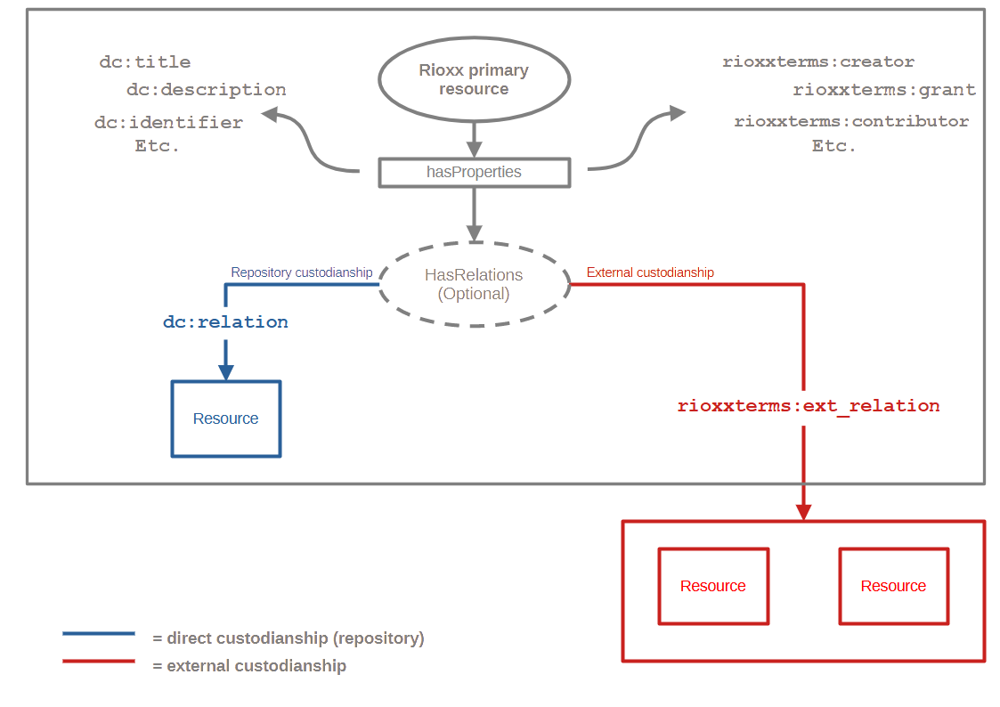

The Rioxx Governance Group (RGG) is pleased to announce that the [final release of 'Rioxx: The Research Outputs Metadata Schema' version 3.0 has now been published](/profiles/v3-0-final/).

The publication of version 3.0 concludes over 3 years of activity, including extensive community consultation, as well as the publication of several candidate releases to solicit further comment from the community. Thanks to all those who contributed!

The general direction of travel for Rioxx 3.0 has been well advertised in [previous blog post](/post/2022/optimising-repository-metadata-for-discovery-and-aggregation/). More than anything this direction has entailed the process of further optimizing Rioxx for discovery. The RGG has therefore paid particular attention to [Rioxx in harvesting and aggregation](https://zenodo.org/doi/10.5281/zenodo.8091545), and its ability to better [reflect the relational nature of scholarly works](https://doi.org/10.17868/strath.00082458). Those familiar with version 2.0 will therefore notice some significant changes to Rioxx, the most notable of which include:

- The introduction of new properties `<rioxxterms:grant>` and `<rioxxterms:project>`, to better distinguish between funded research work and ongoing (potentially unfunded) research projects.
- Improved identification of creators and contributors through the introduction of `<rioxxterms:name>` and `<rioxxterms:id>`, to be used as sub-properties `<rioxxterms:creator>` and `<rioxxterms:contributor>`.
- Superior modelling of significant dates in the publication and repository deposit lifecyle, including the creation of `<rioxxterms:record_public_release_date>` and attributes within `<dc:relation>` and `<rioxxterms:ext_relation>` to capture deposit and exposure dates.
- A major change to the use of `<dc:identifier>`, which now communicates an HTTP(S) URI identifying the primary resource, and which resolves to a repository landing page.
  \## The future is relational
  Perhaps the biggest change between versions 2.0 and 3.0 includes the use of `<dc:identifier>`, which has changed -- as noted above. But version 3.0 also introduces changes to the use of `<dc:relation>`, and the introduction of a new, addition relational property: `<rioxxterms:ext_relation>`.

It is necessary to accept that the future of scholarly outputs is now highly relational. Scholarly outputs may evolve via several significant iterations. They also increasingly [demonstrate a graph of related objects](https://doi.org/10.17868/strath.00085166), some of which may be essential to interpreting and/or describing the scholarly output itself. Rioxx 3.0 therefore introduces the notion of *custodianship* to assist users and machines in interpreting these relations.

Custodianship within Rioxx refers to the concept that the location of a resource is significant to understanding the nature of the thing being described by the Rioxx record. It is also highly relevant to those machines seeking to process, harvest, or aggregate Rioxx metadata. Resources under *direct custodianship* of a repository are therefore those which are under direct management of a local repository or publication platform. These are resources that the local system controls and maintains. Resources outside this *direct custodianship* (e.g. resources at or hosted by third party services) demonstrate *external custodianship*, and form a wider scholarly graph around the primary resource being described by the Rioxx record. `<dc:relation>` and `<rioxxterms:ext_relation>` help us in modelling these relations.



The following now applies in Rioxx version 3.0:

- `<dc:relation>` is now the principal property for expressing the existence of harvestable file content, as well as other internally curated resources. `<dc:relation>` is therefore used to declare resources under direct custodianship of the local repository. [This property is supplemented by a series of attributes](https://rioxx.net/profiles/v3-0-final/#dc:relation), all of which help to describe the nature of the harvestable content.
- `<rioxxterms:ext_relation>` is used to convey external relations to related sources. Such relations will be scholarly resources hosted externally, i.e. outside of the direct custodianship of the repository asserting the relational associations. Examples of these associations might typically include alternative 'expressions' of what `<dc:relation>` is communicating (e.g. preprint, VoR, etc.) and/or resources relevant to understanding, or complementing, `<dc:relation>` such as related research data, software, code, instruments, and so forth.

An example of how `<dc:relation>` and `<rioxxterms:ext_relation>` might be used is provided in the Rioxx snippet below, and the conceptual diagram above should also help readers to distinguish between the two.

``` xml
    <dc:relation
            rel="item"
            type="application/pdf"
            coar_version="https://purl.org/coar/version/c_ab4af688f83e57aa"
            coar_type="https://purl.org/coar/resource_type/c_6501"
            deposit_date="2010-01-20"
            resource_exposed_date="2020-01-20"
            access_rights="https://purl.org/coar/access_right/c_abf2"
            license_ref="https://creativecommons.org/licenses/by-nc-nd/4.0">
            https://spiral.imperial.ac.uk/bitstream/10044/1/76123/2/POP19-AR-58732_accepted.pdf
    </dc:relation>

    <dc:relation rel="cite-as">http://hdl.handle.net/10044/1/76123</dc:relation>
    
    <rioxxterms:ext_relation
            rel="cite-as"
            coar_type="http://purl.org/coar/resource_type/c_6501"
            coar_version="http://purl.org/coar/version/c_970fb48d4fbd8a8">
        https://doi.org/10.1063/1.5128830
    </rioxxterms:ext_relation>
```

A number of example Rioxx records [are provided as an appendix to the version 3.0 schema documentation](https://rioxx.net/profiles/v3-0-final/), each of which demonstrates a different repository use cases.

## There is nothing permanent except change
This announcement of Rioxx version 3.0 necessarily highlights the more significant changes from version 2.0. But a full list of changes can be found in the [release notes](/release notes/). The RGG, as well as [UKCORR](https://www.ukcorr.org/), will work with the community, including developers and funders, to assist and promote take-up of Rioxx version 3.0 in repositories and beyond!

Rioxx continues to be actively maintained and developed. Though version 3.0 has been published the process of review never ends. An updated schema will be issued in future. Comments, issues, etc. are always invited through the [Rioxx GitHub repository](https://github.com/antleaf/rioxx).